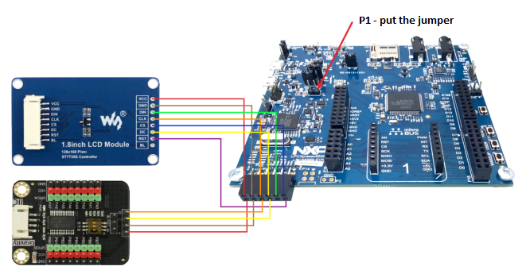
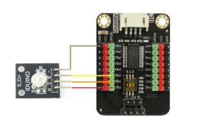

## Table of contents

* [General info](#general-info)
* [Technologies](#technologies)
* [Setup](#setup)

## General info

This project shows how to use QT aplication combined with embeded system to control simple light switch.	

## Technologies

Project is created with:
* QML
* QMake
* C++

## Hardware 

* NXP LPC55s69 microcontroller
* 1.8 inch LCD Module  128x160pixel
* MCP23017 I2C expander
* LED diode 

## Setup

To run this project, download .zip file, and connect hardware like on the photo below

The expander module connect RGB diode like this:

